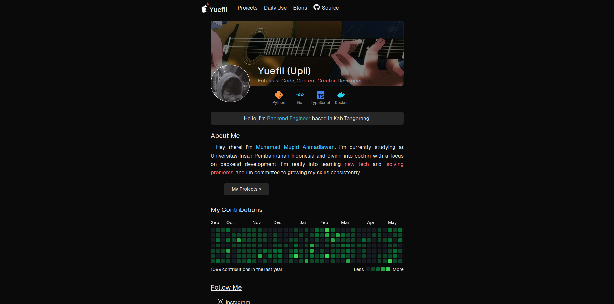

# Personal Website

<p align="center">
  
</p>

### 📖 Clone Project

- Use the following commands to clone the repository:
  ```bash
  git clone https://github.com/Yuefii/portfolio.git
  cd portfolio
  ```

### 🚀  How to Run

- **Install Packages:**
  ```bash
  bun install
  ```
- Then, start the development server with:
  ```bash
   bun dev
  ```
 This will provide various information to proceed with the project.

## ⚙️ License

This project is licensed under the MIT License. See [LICENSE](/LICENSE) for details.